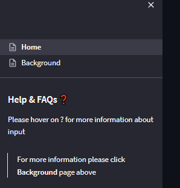
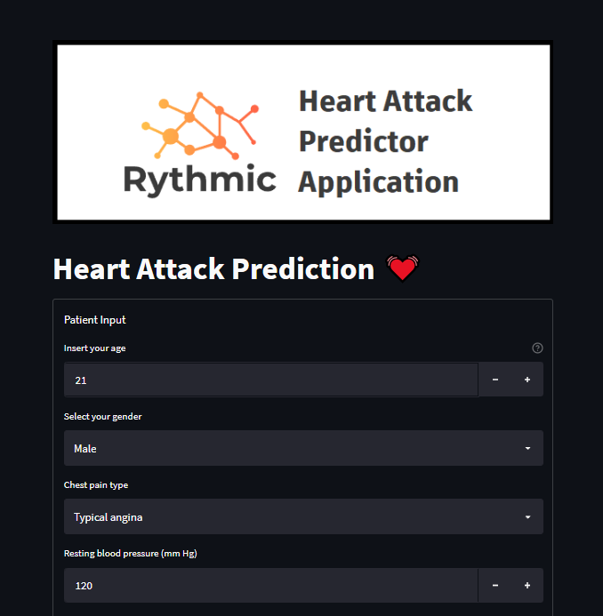
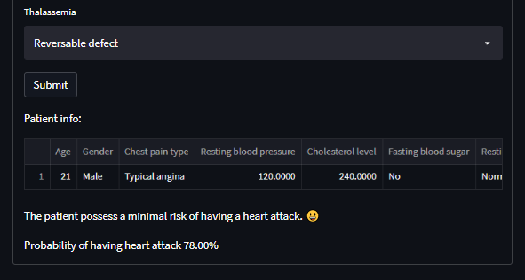
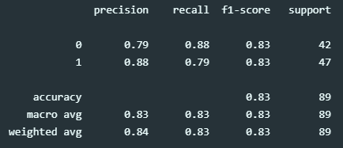

# Heart Attack Predictor Application

# Background
Clinicians think that preventing heart attacks is always preferable to treating them. After extensive research, scientists and clinicians found that factors such as the patient's age, gender, exercise-induced angina, number of major blood vessels, indication of chest pain, resting blood pressure, cholesterol level, fasting blood sugar, resting electrocardiographic results, and maximum heart rate achieved can all be used to predict the likelihood of having a heart attack.

Therefore, this app's goal is to estimate the likelihood that a user may experience a heart attack.

## Dataset information
The dataset for training is around 213 and 91 for testing.

# How to Run the Project
## How to Train the model
1. Clone the repository
2. Open the directory
3. Locate the `Train.py` inside the previous directory of the cloned repository
4. Run the file on your chosen IDEs
5. If done correctly, this will generate the results

## How to Run/Host the Streamlit Web App
1. Clone the repository
2. Open Conda terminal
3. Make sure to open the directory containing the cloned repository in conda using `cd 'example\path'`
4. To run the App, input `streamlit run Home.py`
5. If done correctly, this will launch the web app in your browser

## How to use the Web Application
 - Input the require data, and click 'Background' page on the sidebar for more information
 ### Sidebar

# Web Application and Result

## Web application design

## Result

## Performance/Classification report

# Credits
- [Markdown badges source](https://github.com/Ileriayo/markdown-badges)
- [Dataset source](https://www.kaggle.com/datasets/rashikrahmanpritom/heart-attack-analysis-prediction-dataset)

# Extra Notes
## Check library/module used in the requirements.txt
